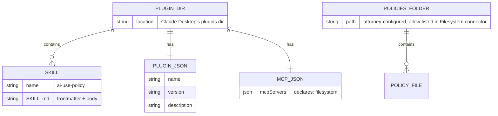

# AI Use Policy Generator — Technical

**Product:** AI Use Policy Generator (Claude Desktop plugin)
**Audience:** Solo and small-firm attorneys using Claude Desktop
**Distribution model:** Free download (lead magnet) → consulting upsell ($3K–$6K)
**Team size assumed:** 1 developer + 1 content/legal SME
**Monthly infrastructure budget assumed:** $0 at MVP scale

---

## Architectural Context

This product is a **Claude Desktop plugin** — a small folder structure containing skill content and a manifest, packaged as a `.zip` file the attorney installs into Claude Desktop with a one-click drag-and-drop. There is no backend, no MCP server, no auth layer, and no per-user infrastructure.

(`.zip` is a ZIP archive that Claude Desktop recognises natively. The format has two variants: **standalone** bundles a single MCP server, and **plugin** bundles skills plus declared connector requirements. We use the plugin variant.)

The plugin reduces to two layers:

1. **Skill content** — one `SKILL.md` file and a master system prompt. This is the entirety of what we produce.
2. **Distribution infrastructure** — a landing page (WordPress on protomated.com), email capture form, and `.zip` hosting. The landing page is managed separately from this repo.

Marginal cost per installed attorney is zero. Infrastructure cost is flat regardless of download volume up to ~10K email subscribers.

---

## 1. Stack Summary

| Layer | Technology | Notes |
|---|---|---|
| **Plugin Runtime** | Claude Desktop (managed by Anthropic) | We write no runtime code. |
| **Plugin Format** | Claude Plugin (`.claude-plugin/plugin.json` + `.mcp.json` + `skills/`), packaged as `.zip` (plugin variant) | Open spec at code.claude.com/docs/en/plugins. |
| **Skills** | `SKILL.md` (Anthropic spec) | YAML frontmatter + markdown body. One file. |
| **Filesystem Integration** | Claude Desktop built-in Filesystem connector | Declared as required in `.mcp.json`. Anthropic handles path permissions. Used to save generated policy documents. |
| **Landing Page** | WordPress on protomated.com | `/templates/ai-use-policy-generator/` — managed outside this repo. |
| **Plugin Hosting** | GitHub Releases | Free unlimited bandwidth for public `.zip` release assets. |
| **Email Capture** | Kit (formerly ConvertKit) — free Newsletter plan | Up to 10,000 subscribers free. |
| **Code Hosting / CI** | GitHub + GitHub Actions | Free; CI packs the `.zip` on tag push. |

**Total monthly cost at MVP scale: $0.**

---

## 2. Key Architectural Decisions

### 2.1 Use Claude Desktop's built-in Filesystem connector; build no MCP servers

**Decision:** The plugin declares only Filesystem as a required connector in `.mcp.json`. No Gmail, no Google Calendar, no custom MCP server.

**Why:** The `/ai-use-policy` skill works entirely from the attorney's in-conversation answers — it conducts an interview and drafts three documents. It has no need to read email or calendar. The only external operation is optionally saving the generated documents to the attorney's local filesystem.

Claude Desktop ships a first-party managed Filesystem connector. Declaring it as a requirement via `.mcp.json` causes Claude Desktop to prompt the attorney with a "Connect" button; Anthropic handles path permissions. We never touch attorney credentials or write any integration code.

**Trade-off:** We are coupled to whatever tool names and capabilities the Filesystem connector exposes. If Anthropic renames a tool, the skill needs a one-line update. Mitigation: monitor Anthropic's changelog.

### 2.2 Plugin variant of `.zip`, not standalone

**Decision:** Package as the **plugin variant** of `.zip`, not the standalone variant.

**Why:** The **standalone** variant bundles a single MCP server with its dependencies — appropriate when shipping a custom MCP server. The **plugin** variant bundles skills + connector requirement declarations + manifests — appropriate when reusing Anthropic's built-in connectors. Since we ship no MCP server, the plugin variant is the right choice.

**Both variants give the attorney the same one-click `.zip` install experience** in Claude Desktop. The choice is purely about what's inside the bundle.

### 2.3 Compliance language lives in skills, not in a custom UI

**Decision:** Required ethical guardrails (ABA Op. 512 / *Heppner* warnings, and the "starting draft, must be reviewed and formally adopted" caveat) are enforced through the master system prompt and through mandatory headers/footers in every skill output, not through a custom first-run screen.

**Why:** Plugins do not execute code on install — they cannot show custom UI. The compliance layer must be content-driven. This is acceptable because Claude is the surface where attorneys interact with the plugin, and Claude enforces the system prompt on every conversation.

**Implementation:** The `SKILL.md` body instructs Claude to prefix and suffix every output with the required attorney-review and adoption-required language. The README's first section is a hard compliance gate the attorney must read before configuring the plugin.

---

## 3. Infrastructure

### 3.1 Hosting & Deployment

| Environment | Purpose | Host |
|---|---|---|
| **Dev** | Local plugin development and skill testing | Developer's laptop; plugin loaded into Claude Desktop via Personal Plugins panel |
| **Distribution** | Landing page + `.zip` download | WordPress/protomated.com (landing) + GitHub Releases (`.zip` artifact) |
| **CI/CD** | Validate skill, pack, and publish on git tag | GitHub Actions |

**CI flow on tag push (`v1.0.0`, etc.):**
1. Run `npm run validate` (`scripts/validate-plugin.mjs`) against `plugin.json`, `.mcp.json`, and `SKILL.md` frontmatter
2. Run `npm run pack` to produce `ai-use-policy-generator-v1.0.0.zip`
3. Run `npm run checksum` to compute SHA-256
4. Publish `.zip` + checksum to GitHub Releases

### 3.2 "Database" Schema (local-only state)

There is no central database. State lives entirely on the attorney's machine and inside Claude Desktop:



**What this means:**
- The plugin directory lives wherever Claude Desktop stores Personal Plugins.
- The Filesystem connector path is configured by the attorney — the plugin can only read/write within that path.
- No cloud-side records, ever. We do not know who has installed the plugin.

### 3.3 Background Jobs

There are no background jobs anywhere. The plugin is static content. The only periodic processes are on the distribution side:

| Job | Schedule / Trigger | Purpose |
|---|---|---|
| **CI: build & release** | On git tag push | GitHub Actions validates the skill and publishes the `.zip`. |
| **Email drip sequence** | Triggered by download/opt-in | Kit sends a nurture sequence ending in a consulting CTA. |

### 3.4 Third-Party Integrations

| Service | Purpose | Tier / Cost at MVP |
|---|---|---|
| **Anthropic Claude Desktop** | The runtime | Paid by attorney (Claude for Work / Team / Enterprise) |
| **GitHub Releases** | `.zip` artifact distribution | Free (unlimited bandwidth on public release assets) |
| **Kit (ConvertKit)** | Email capture + nurture sequence | Free Newsletter plan up to 10,000 subscribers |
| **GitHub Actions** | CI/CD pipeline | Free on public repos |

**Total third-party cost at MVP: $0/month.**

---

## 4. Authentication & Security

### 4.1 Auth approach

**We have no authentication system.** The only connector this plugin requires is Filesystem, which does not involve OAuth — Claude Desktop prompts the attorney to select an allowed folder path. No credentials leave the attorney's machine.

The only auth-adjacent thing we ship is the connector declaration in `.mcp.json`:

```json
{
  "mcpServers": {
    "filesystem": { "type": "http", "url": "" }
  }
}
```

When the attorney installs the plugin, Claude Desktop's Connectors panel shows Filesystem with a "Connect" button and the note "Required by: AI Use Policy Generator." One click — selecting the firm policies folder — completes setup.

### 4.2 Data handling policies

| Data class | Where it lives | Retention |
|---|---|---|
| Skill files | Plugin directory inside Claude Desktop | Until attorney uninstalls the plugin |
| Interview answers | Transient — held only in Claude's conversation context | Subject to attorney's Claude plan retention |
| Generated policy documents (if saved) | Attorney's local filesystem, in the folder they configured | Never copied or transmitted by us |
| Landing-page email | Kit subscriber list | Until subscriber unsubscribes; deletable on request |

**Nothing the plugin processes is ever transmitted to Protomated infrastructure.**

### 4.3 Compliance considerations

- **ABA Model Rule 1.6 (Confidentiality):** The README's first section is a hard compliance gate. It explains that attorneys must be on Claude for Work / Team / Enterprise (or Claude API with a DPA) before entering confidential firm information. The master system prompt repeats this warning at every session start.
- **ABA Formal Op. 512 (July 2024):** Every skill output includes the mandatory "AI-assisted, attorney review required" header and "starting draft, attorney adoption required" footer.
- **GDPR / CCPA:** The email capture on the landing page complies with both (clear opt-in, unsubscribe link, privacy policy linked). No PII processing inside the plugin.
- **Heppner (SDNY, Feb. 2026):** README and master system prompt warn explicitly about the privilege-waiver risk of using consumer-tier Claude with confidential firm information.

### 4.4 Security measures

- **Bundle integrity:** SHA-256 checksum published alongside every `.zip` release on GitHub.
- **No custom code surface:** We ship no executables, no MCP servers, no scripts. Reviewers can audit the entire plugin by reading the markdown files and two JSON manifests.
- **No network egress from our code:** Because we have no code. The only external operation is optional file writes via the Filesystem connector, which stays on the attorney's local machine.
- **Confirmation gating:** All file-write operations are enforced in the master system prompt — Claude must obtain explicit attorney confirmation in the conversation before saving any file.

---

## 5. API Architecture

### 5.1 Internal API

**The plugin exposes no API.** It declares which connector it needs (Filesystem) and provides skill content that Claude consumes when that connector is active.

### 5.2 Tools consumed (provided by Claude Desktop's built-in Filesystem connector)

Tool names should be **verified against the live Claude Desktop Filesystem connector** before finalising the skill. Expected surface:

| Connector | Expected tools |
|---|---|
| **Filesystem** | list directory, read file, write file (within configured allow-list) |

The `SKILL.md` references these tools by name. If Anthropic renames or changes a tool, the skill needs a one-line update.

### 5.3 Key Abstractions

There are no abstractions in code because there is no code. The "abstraction" is the SKILL.md format itself: the skill describes the interview to conduct, how to analyse the answers, what three documents to produce, and when to ask for filesystem confirmation. Claude executes the abstraction.

---

## 6. Cost Projections

### 6.1 Per-unit cost breakdowns

- **Per-attorney compute cost: $0.** Plugin runs on the attorney's Claude subscription.
- **Per-attorney connector cost: $0.** The Filesystem connector is managed by Anthropic as part of Claude Desktop.
- **Per-download bandwidth cost: $0.** GitHub Releases offers unlimited bandwidth for public `.zip` release assets.
- **Per-email-subscriber cost: $0** up to 10,000 subscribers on Kit's free Newsletter plan.

### 6.2 Monthly cost projections

The relevant scaling variable is **number of downloads / email subscribers**, not active users.

| Stage | Subscribers / Downloads | Monthly Cost | Breakdown |
|---|---|---|---|
| **MVP** | 0–500 | **$0** | All free tiers — GitHub Releases, Kit free |
| **Growth** | 500–5,000 | **$0** | Same free tiers; no upgrades needed |
| **Scale** | 5,000–10,000 | **$0** | Kit still free under 10K subs |
| **Beyond 10K** | 10,000+ | **~$59/mo** | Kit Creator plan (~$59/mo at 3K–5K subs); scales with list size |

### 6.3 Unit economics

Infrastructure cost is effectively zero up to 10,000 subscribers, so **gross margin on the consulting upsell is 100% minus consultant labour**. Worked example: 1,000 downloads → 200 opt-ins → 2% lead-to-paid = 4 consulting engagements at $4,500 average = $18,000 revenue against $0 infrastructure cost.

---

## 7. Environment Variables

The plugin itself has no environment variables. It is static content.

### CI/CD (GitHub Actions secrets)

| Variable | Required | Notes |
|---|---|---|
| `GITHUB_TOKEN` | Auto-provided | Used by `gh release create` to publish releases |

### Kit / email capture

Kit form configuration is managed in the Kit dashboard, not in this repo. The WordPress landing page's form points to the Kit form directly.

---

## 8. Development Setup

**Assumed already installed:** git, a text editor, Claude Desktop.

```bash
# 1. Clone
git clone https://github.com/protomated/claude-ai-use-policy-generator.git
cd claude-ai-use-policy-generator

# 2. Inspect the structure
tree plugin/
# plugin/
# ├── .claude-plugin/plugin.json
# ├── .mcp.json
# ├── manifest.json
# ├── prompts/system-prompt.md
# ├── skills/
# │   └── ai-use-policy/SKILL.md
# ├── CONNECTORS.md
# ├── LICENSE
# └── README.md

# 3. Install the plugin into Claude Desktop for testing
# Open Claude Desktop → Customize → Personal plugins → "+"
# Point it at the plugin/ directory

# 4. In Claude Desktop → Connectors, click "Connect" on Filesystem
# Select your firm policies folder (e.g. ~/Documents/Firm-Policies)
# (One-time setup; Anthropic handles path permissions)

# 5. Verify in a new chat:
#    - /skills lists /ai-use-policy
#    - Run /ai-use-policy and step through the interview
#    - Confirm all three documents are generated correctly
#    - Test the save flow: confirm a file write and verify it lands in your policies folder
```

**For packaging a release:**

```bash
# Validate, pack, checksum in one step
npm run build

# Or individually:
npm run validate   # validate plugin/ structure (scripts/validate-plugin.mjs)
npm run pack       # zip to ai-use-policy-generator-v1.0.0.zip
npm run checksum   # compute SHA-256

# Cut a GitHub release (runs build first, then gh release create)
npm run release
```

Attorneys install by double-clicking the `.zip` file or dragging it into Claude Desktop's Extensions panel — Claude Desktop handles the rest.

---

## 9. Third-Party Service Setup

### 9.1 Kit (formerly ConvertKit) — Email capture

**Signup URL:** https://kit.com

- Sign up for the free **Newsletter plan** (10,000-subscriber limit)
- Create a form titled "AI Use Policy Generator Download"
- Configure the success action to send an email containing the GitHub Releases download link
- Build a nurture sequence ending in a consulting/Fractional Advisory CTA

**Tier at MVP:** Free Newsletter plan.

### 9.2 GitHub — Source, Releases, CI

**Signup URL:** https://github.com

- Create the `claude-ai-use-policy-generator` repository (private during dev, public for release)
- Configure GitHub Actions secrets per Section 7
- First release published manually via UI; subsequent via CI on tag push

**Tier at MVP:** Free.

---

## 10. Deployment Checklist

### 10.1 Pre-Launch

- [ ] `SKILL.md` validated against Anthropic's skill spec (`npm run validate` passes)
- [ ] Tool names in the skill verified against Claude Desktop's live Filesystem connector
- [ ] Master system prompt reviewed by a licensed attorney
- [ ] Compliance language (README first section + skill headers/footers + "starting draft" caveat in all three documents) reviewed by a licensed attorney
- [ ] README and CONNECTORS.md proofread
- [ ] Loom walkthrough video recorded — showing install, connector connect, full interview, and document save
- [ ] Plugin tested on a clean macOS Claude Desktop install
- [ ] Plugin tested on a clean Windows Claude Desktop install
- [ ] Kit form, success email, and nurture sequence configured
- [ ] GitHub Release v1.0.0 published with `.zip` + SHA-256 checksum
- [ ] WordPress landing page download link updated to point to the v1.0.0 release URL

### 10.2 Launch Day

- [ ] CI on `v1.0.0` tag completes; `.zip` is in GitHub Releases
- [ ] Landing page download link points to the correct release URL
- [ ] End-to-end test: landing page → opt-in → email → download → install → connect Filesystem → run `/ai-use-policy` → verify all three documents generated → confirm file save
- [ ] SHA-256 checksum verified
- [ ] Post LinkedIn launch announcement (Dele) linked to landing page
- [ ] Monitor first 24h of downloads in Kit dashboard

### 10.3 Post-Launch

- [ ] Kit broadcast to existing subscribers each time a new version ships
- [ ] Quarterly review of Anthropic's plugin spec and Filesystem connector tool surface for breaking changes
- [ ] Quarterly review of ABA opinions and state-bar AI-ethics guidance — update state ethics placeholder list in SKILL.md if new jurisdictions publish guidance
- [ ] Monthly check on Kit subscriber count vs. 10K free-tier ceiling
- [ ] Runbook for the most common failures (Filesystem path not found, permission denied outside allow-list, restart-required-after-install)
- [ ] Feedback channel (GitHub Issues + `mailto:` in the README) triaged weekly
- [ ] Track download-to-consulting-call conversion in Kit; target ≥3%

---

## Build Effort Estimate

| Deliverable | Hours |
|---|---|
| `plugin.json` + `manifest.json` manifests | 1 |
| `.mcp.json` connector declaration | 0.5 |
| `SKILL.md` — guided interview + three-document generator (including compliance review + test) | 6 |
| `prompts/system-prompt.md` (master prompt + ethical guardrail enforcement) | 2 |
| `README.md` (with compliance gate first section) | 2 |
| `CONNECTORS.md` (Filesystem connector setup) | 0.5 |
| Loom walkthrough video | 2 |
| QA on macOS + Windows | 2 |
| Legal/SME review pass | 3 |
| **Total** | **~19 hours** |

**Estimated timeline:** 3–4 days (1 developer + 1 content/legal SME working in parallel).
